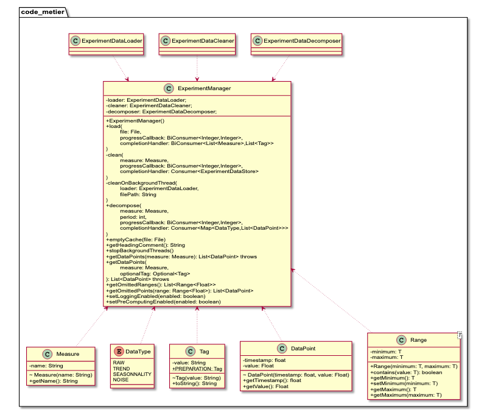

# IMT Atlantique - FIL A1 - Mini-Projet ACDC

*Rémi BARDON*  
*Novembre 2020*

## Présentation

### Thème

Nettoyage, préparation et visualisation de données

### Responsable

Charles Prud’homme – <charles.prudhomme@imt-atlantique.fr>

### Sujet

> Les attentes sociétales en matière d’éthique, de droit et de bien-être animal ont considérablement progressé au cours des dernières années. Les formations en physiologie animale doivent adapter l’offre pédagogique aux attentes des apprenants et à l’évolution de la législation, dans le respect du bien-être animal.
>
> Dans ce contexte, il vous est demandé de participer à la conception d’un simulateur réaliste piloté par de l’intelligence artificielle, se substituant complètement aux animaux vivants pour les travaux pratiques de physiologie expérimentale.
>
> Votre travail consistera à nettoyer, préparer et visualiser les séries temporelles issues des données de physiologie expérimentale collectées au cours des dix dernières années à Oniris. Ce travail devra permettre de préparer le pilotage des fonctions vitales du robot-lapin développé en parallèle.

### Commentaires

> Vous trouverez des informations sur l'extraction de la tendance et de la saisonnalité sur le site suivante :
>
> <https://www.machinelearningplus.com/time-series/time-series-analysis-python/>
>
> En particulier, à partir de la section 6.
>
> Dans notre cas, le modèle additif est tout à fait adapté.
>
> <https://anomaly.io/seasonal-trend-decomposition-in-r/index.html>
>
> <https://en.wikipedia.org/wiki/Decomposition_of_time_series>

## Décisions d'équipe

Les décisions suivantes ont été prises le 8 octobre 2020 dans le but de faire émerger les besoins liés au code métier produit par chacun des 4 étudiants.

Seuls les besoins ont été décidés en commun, l'[API](https://en.wikipedia.org/wiki/API), quant a elle, est le fruit du travail individuel des étudiants.

### Données accessibles

- Donnée brute par `timestamp`, `tag` et mesure
- Tendance par `timestamp`, `tag` et mesure
- Saisonnalité par `timestamp`, `tag` et mesure
- Bruit par `timestamp`, `tag` et mesure
- Étendue (`min` et `max`) de la donnée brute, la tendance, la saisonnalité et le bruit, le tout par `tag` et mesure
- Plages de données omises (début/fin)
- `Tag`s présents dans le fichier
- `Tag`s `"préparation"` et `"euthanasie"` (disponibles, mais pas de convention de nommage)
- Commentaire en haut du fichier (le cas échéant)

### Formattage

- Si une plage de données est retirée, la suite doit être "collée" (éditer les `timestamp`s suivants)

## Décisions personnelles (Rémi BARDON)

### Données inaccessibles

- J'ai décidé de ne pas créer de `Tag` `"euthanasie"`, car il est impossible de savoir quand celle-ci a lieu. Nous n'avions pas pensé à ça.

### Possibilités & restrictions

- 0 ou 1 tag sélectionné à la fois (séance entière ou seulement une partie)
- 1 ou plusieurs mesures sélectionnées à la fois

### Use cases

> "Les 4 graphiques" désigne ici les graphiques temporels (temps en abscisses) de données brutes, tendance, saisonnalité et bruit (en ordonnées).

- Pas de fichier importé
  - [x] Affichage de l'**interface vide**
    - Pas de mesure sélectionnée
    - 4 données (brut, tendance, saisonnalité, bruit)
    - Pas de tag sélectionné
- Fichier importé
  - [x] Affichage de la **pression artérielle** sur les 4 graphiques pour la **séance entière**
    - 1 mesure sélectionnée
    - 4 données (brut, tendance, saisonnalité, bruit)
    - Pas de tag sélectionné (séance entière)
  - [x] Affichage de la **pression artérielle** sur les 4 graphiques pour la **période de début de la séance**
    - 1 mesure sélectionnée
    - 4 données (brut, tendance, saisonnalité, bruit)
    - 1 tag sélectionné
  - [ ] Affichage de la **fréquence cardiaque** et de la **fréquence respiratoire** sur les 4 graphiques pour la **période de fin de la séance**
    - 2 mesures sélectionnées
    - 4 données (brut, tendance, saisonnalité, bruit)
    - 1 tag sélectionné

### Architectural Decision Records (ADR)

- Le `timestamp` stocké dans [`DataPoint`](src/main/java/code_metier/DataPoint.java) est un `float` et non un `Float` pour réduire la taille des objets en mémoire (important au vu du nombre de données).
- La valeur d'un [`DataPoint`](src/main/java/code_metier/DataPoint.java) est un `Float` et non un `float` pour permettre l'utilisation des valeurs `NaN`.
- [`DataPoint`](src/main/java/code_metier/DataPoint.java) ne contient pas de référence à [`Tag`](src/main/java/code_metier/Tag.java) pour réduire la taille des objets en mémoire (important au vu du nombre de données).
- ~~Les classes [`ExperimentDataLoader`](src/main/java/code_metier/ExperimentDataLoader.java), [`ExperimentDataCleaner`](src/main/java/code_metier/ExperimentDataCleaner.java) et [`ExperimentDataDecomposer`](src/main/java/code_metier/ExperimentDataDecomposer.java) ne sont pas censées être publiques. Par manque de temps, je n'ai pas eu le temps de tout implémenter dans [`ExperimentManager`](src/main/java/code_metier/ExperimentManager.java), donc je les ai laissées publiques pour permettre l'accès à toutes les fonctionnalités si besoin.~~ Normalement tout est disponible, mais j'ai laissé quand même comme ça au cas où.

### Diagramme de classes

> Remarque: Ceci n'est pas ni diagramme de classes `Java` ni un réel diagramme de classes suivant toutes les normes `UML`. Je l'ai un peu simplifié pour faciliter la lecture.  
> Par exemple, certaines méthodes comme `toString()` ou `hashCode()` ne sont pas présentes.  
> J'ai également enlevé les propriétés privées qui prenaient une place trop importante. Le but de ce diagramme est de présenter la partie publique.



### Structure du projet Java

#### Utilisation de Maven

Pour faciliter l'utilisation de packages permettant la lecture de fichiers [CSV](https://en.wikipedia.org/wiki/Comma-separated_values) (grâce à [opencsv](https://mvnrepository.com/artifact/com.opencsv/opencsv) et la [décomposition de données temporelles](https://en.wikipedia.org/wiki/Decomposition_of_time_series) (avec le package [Seasonal Decomposition of Time Series](https://github.com/ServiceNow/stl-decomp-4j) dans notre cas), j'ai choisi d'utiliser [Maven](https://maven.apache.org/).

#### Nommage des packages

Le nommage des packages a été fait en suivant les [conventions de nommage](https://docs.oracle.com/javase/tutorial/java/package/namingpkgs.html) décrites par Oracle.

## Dépendances

- `code_metier`
  - [OpenCSV](https://mvnrepository.com/artifact/com.opencsv/opencsv) : Lecture et sérialisation de fichiers `CSV`.
  - [stl-decomp-4j](https://mvnrepository.com/artifact/com.github.servicenow.stl4j/stl-decomp-4j) : Décomposition de données temporelles
  - [JUnit 5](https://mvnrepository.com/artifact/org.junit.jupiter/junit-jupiter) : Tests unitaires

## Prérequis

> TODO

## Utilisation

### `code_metier`

```java
// Class fields (local for demonstration)
int period = 4;
Measure selectedMeasure;
Optional<Tag> selectedTag = Optional.empty();
String headingComment = "";
List<Measure> measures;
List<Tag> tags;
Map<DataType, List<DataPoint>> dataPoints;

File file;
final ExperimentManager manager = new ExperimentManager();
this.manager.setLoggingEnabled(false); // Default value
this.manager.setPreComputingEnabled(true); // Default value

// ...

file = new File(/* ... */);

// Load file
this.manager.load(
    this.file,
    (progress, total) -> {
        System.out.println("Loading: " + progress + "/" + total);

        // Update UI
    },
    (measures, tags) -> {
        System.out.println("Finished loading");
        System.out.println("Measures: " + measures + "; Tags: " + tags);

        this.measures = measures;
        this.tags = tags;
        this.headingComment = this.manager.getHeadingComment();

        // Update UI
    }
);

// ...

this.selectedMeasure = /* ... */;
this.selectedTag = Optional.of(/* ... */);

this.manager.decompose(
    this.file,
    this.selectedMeasure,
    this.period,
    (progress, total) -> {
        System.out.println("Decomposing " + progress + "/" + total);

        // Update UI
    },
    (pointsPerType) -> {
        System.out.println("Finished decomposing");

        this.dataPoints = pointsPerType;
        // Or
        // this.dataPoints = this.manager.getDataPoints(this.selectedMeasure, this.selectedTag);

        // Update UI
    }
);
```

## Tests unitaires

Les tests unitaires, écrits avec [JUnit 5](https://junit.org/junit5/), couvrent toutes les méthodes les plus importantes de [`ExperimentDataLoader`](src/main/java/code_metier/ExperimentDataLoader.java), [`ExperimentDataCleaner`](src/main/java/code_metier/ExperimentDataCleaner.java), [`ExperimentDataDecomposer`](src/main/java/code_metier/ExperimentDataDecomposer.java) et [`ExperimentManager`](src/main/java/code_metier/ExperimentManager.java).

J'ai créé deux *test suites*, une nommée `"All Tests"`, qui exécute tous les tests, et une nommée `"Fast Tests"`, qui évite l'exécution des tests sur données réelles (pratique pour le *coverage*). La différence entre les tests rapides (normaux) et les tests lents est faite grâce à l'annotation [`@Slow`](src/test/java/code_metier_tests/Slow.java) qui applique le [Tag JUnit](https://junit.org/junit5/docs/current/user-guide/#writing-tests-tagging-and-filtering) `"slow"`.

En parlant de *coverage*, depuis que je suis passé à [JUnit 5](https://junit.org/junit5/), je n'ai pas réussi à exécuter les tests pour du *coverage*. La console d'[Eclipse](https://www.eclipse.org/) envoie plein d'erreurs, et après des heures de recherches je n'ai pas réussi à les régler.
